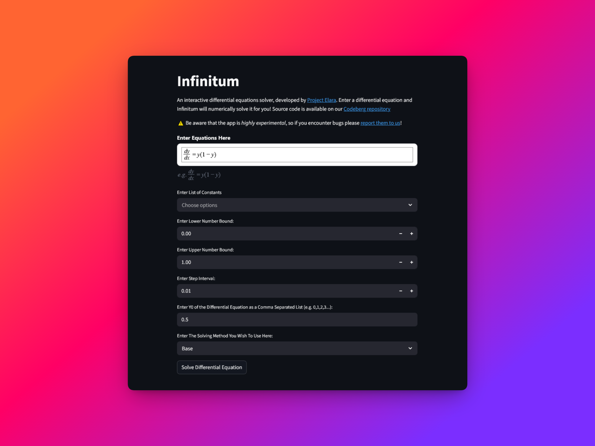

# Infinitum

This is a Desmos-like webapp that serves as a frontend to the [Elara symbolic](https://codeberg.org/elaraproject/elara-symbolic) library, allowing using the library without any coding experience. Includes facilities for computing derivatives and integrals (both symbolically and numerically) as well as solving differential equations.

The equation editor now uses a custom Streamlit MathQuill component instead of the older streamlit-mathlive plugin.

> Currently the app is MIT-licensed, but if all contributors are willing, we would be more than happy to turn it into public-domain licensed software.


## Why the name?

The name _infinitum_ comes from Latin and means "infinity". The name was chosen because a large number of the (planned) functionalities of the app are calculus-based, such as solving differential equations. Historically, calculus was known as _infinitesimal calculus_, hence the origin of the name _infinitum_ for the app.

> **Note:** The name right now is TBD, we may keep it as this or switch to another name.

## Development instructions

First clone the repository on to your machine:

```bash
git clone https://codeberg.org/elaraproject/elara-symbolic-ui.git
```

Make and activate a virtual environment (using conda is also fine):

```bash
python -m venv .venv/

# Activate a virtual env

# Linux/macOS
source .venv/bin/activate

# Windows powershell
source .venv/Scripts/Activate.ps1

# Git bash on Windows/Cygwin
source .venv/Scripts/activate
```

> **Note:** You will have to activate the virtual environment whenever you are developing the app.

There are now two ways to proceed; the recommended method, which uses [Poetry](https://python-poetry.org/), or an alternative method which doesn't use poetry.

### Recommended installation

We use the [Poetry](https://python-poetry.org/) package manager for dependency management. To install poetry, the full instructions are in the [Poetry docs](https://python-poetry.org/docs/). However, the basic installation can be done in two commands:

```bash
pip install pipx # only if you don't have pipx installed
pipx install poetry
``` 

Assuming you have Poetry installed, run the following command to resolve and install dependencies from the `pyproject.toml` file. 

```bash
poetry install
```

> **Note:** This is needed **only** on the first installation!

Afterwards, you can launch the app anytime by running:

```bash
poetry run streamlit run src/main.py

To run the basic regression test for the differential-equation parser and solver, use:

```bash
python -m pytest tests/test_differential_equation.py
```
```


### Alternative installation

If you don't want to use Poetry, it is also possible to install dependencies with just pip;

```bash
pip install -r requirements.txt
```

Then, from the repo you have cloned, just run the following commands to launch the app:

```bash
python -m streamlit src/main.py
# if the above command doesn't work, run below command instead
python -m streamlit run src/main.py --global.developmentMode=false
```

### Running app in headless mode
By default, the streamlit run command opens up the local web browser. This can be potentially intrusive and annoying if you want to use a browser other than your OS-set default browser. Instead, the following commands can be used to run in "headless mode", where streamlit will print the localhost web server address and allow you to open the webapp in the browser of your choice. This can be done by the following commands:

```bash
# with poetry
poetry run streamlit run src/main.py --server.headless true

# vanilla Python (without poetry)
streamlit run src/main.py --server.headless true
```

## Future Features

- Create an interface capable of processing and solving differential equations input as LaTeX by users
- Add graphs of the differential equations so that the user can visualize the equation they have input

## Support Project Elara

If you'd like to help fund our work, you can support us on OpenCollective:

<a href="https://opencollective.com/project-elara/donate" target="_blank">
  
</a>

## Contributors

- [Jacky Song](https://codeberg.org/songtech-0912)
- [Jacob Thomas](https://codeberg.org/NHWXCodeberg)
- [David Yang](https://codeberg.org/David_Y)
